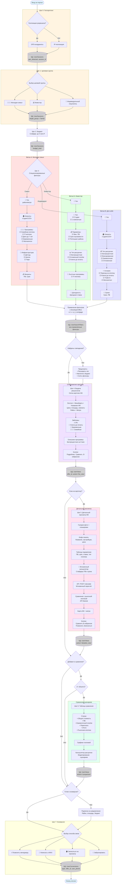

```mermaid
flowchart TD 
    Start([Вход на портал]) --> GeoCheck{Геолокация разрешена?}
    
    subgraph Geo[Шаг 0: Геотаргетинг]
        GeoCheck -->|Да| GPS[GPS-координаты]
        GeoCheck -->|Нет| IP[IP-геолокация]
        GPS --> GeoDB[(БД: UserSessions<br/>geo_detected, session_id)]
        IP --> GeoDB
    end
    
    GeoDB --> TargetGroup{Выбор целевой группы}
    
    subgraph Step1[Шаг 1: Целевая группа]
        TargetGroup --> Family[👨‍👩‍👧 Молодая семья]
        TargetGroup --> Investor[💰 Инвестор]
        TargetGroup --> Individual[👤 Индивидуальный покупатель]
        
        Family --> TGDB[(БД: UserSessions<br/>target_group = 'family')]
        Investor --> TGDB
        Individual --> TGDB
    end
    
    TGDB --> Budget[Шаг 2: Бюджет<br/>Слайдер: до X млн ₽]
    Budget --> BudgetDB[(БД: UserSessions<br/>budget_total)]
    
    BudgetDB --> Filters{Шаг 3: Специализированные фильтры}
    
    subgraph FamilyFilters[Ветка А: Молодая семья]
        Filters -->|Семья| FamGeo[📍 Гео<br/>район/метро]
        FamGeo --> FamRooms[🏠 Комнаты<br/>студия/1/2/3+]
	    FamRooms --> FamPrograms[👨‍👩‍👧 Программы:<br/>☑ Семейная ипотека<br/>☑ IT-ипотека<br/>☑ Дети до 7 лет<br/>☑ Беременным<br/>☑ Маткапитал]
        FamPrograms --> FamInfra[🏫 Инфраструктура:<br/>☑ Детсад<br/>☑ Школа<br/>☑ Парк]
        FamInfra --> FamFinance[💰 Финансы:<br/>ПВ, Срок]
    end
    
    subgraph InvestorFilters[Ветка Б: Инвестор]
        Filters -->|Инвестор| InvGeo[📍 Гео]
        InvGeo --> InvType[🏢 Тип:<br/>☑ Студии<br/>☑ 1-комнатные]
        InvType --> InvParams[💰 Параметры:<br/>☑ Мин. ПВ<br/>☑ Срок окупаемости<br/>☑ Потенциал района]
        InvParams --> InvInstallment[📊 Тип рассрочки:<br/>☑ Беспроцентная<br/>☑ Отложенный платёж<br/>☑ Ключи до оплаты]
                 InvInstallment --> InvPrograms[🏦 Льготные программы:<br/>☑ IT-ипотека]
         InvPrograms --> InvROI[🎯 Доходность:<br/>Арендная ставка]
    end
    
    subgraph IndividualFilters[Ветка В: Для себя]
        Filters -->|Индивидуал| IndGeo[📍 Гео]
        IndGeo --> IndRooms[🏠 Комнаты<br/>студия/1/2/3+]
        IndRooms --> IndType[💳 Тип рассрочки:<br/>☑ Беспроцентная<br/>☑ Фиксированная<br/>☑ Ежемесячная<br/>☑ Отложенная]
		 IndType --> IndUnique[⭐ Условия:<br/>☑ Переход на ипотеку<br/>☑ Ключи до оплаты<br/>☑ Trade-In<br/>☑ Маткапитал]
        IndUnique --> IndTerms[📅 Сроки:<br/>Срок, ПВ]
    end
    
	FamFinance --> ApplyFilters[Применение фильтров<br/>к DeveloperOffers<br/>в т.ч. is_it_mortgage]
    InvROI --> ApplyFilters
    IndTerms --> ApplyFilters
    
    ApplyFilters --> FilterDB[(БД: UserSearchFilters<br/>все применённые фильтры)]
    
    FilterDB --> Results{Найдены совпадения?}
    
    Results -->|Да| DisplayCards[Шаг 4: Выдача результатов<br/>Сетка карточек ЖК]
    Results -->|Нет| SuggestExpand[Предложить:<br/>• Расширить гео<br/>• Увеличить бюджет<br/>• Снять фильтры]
    SuggestExpand --> DisplayCards
    
    subgraph CardDisplay[Отображение карточек]
        DisplayCards --> CardInfo[Логотип + МиниКарта + Название ЖК<br/>Цена, площадь, комнаты<br/>Район + Метро]
        CardInfo --> CardBadges[Эмблемы:<br/>🔥 0%<br/>🔑 Ключи до оплаты<br/>🤰 Беременным<br/>👨‍👩‍👧 Семейная]
        CardBadges --> CardDesc[Описание программы:<br/>Беспроцентная на 9 мес]
        CardDesc --> CardActions[Кнопки:<br/>Подробнее  Сравнить  В избранное]
    end
    
    CardActions --> ViewDB[(БД: UserViews<br/>offer_id, action='list_view')]
    
    ViewDB --> ClickCard{Клик на карточку?}
    
    ClickCard -->|Да| DetailedView[Шаг 5: Детальный просмотр ЖК]
    ClickCard -->|Нет| CompareCheck{Добавил в сравнение?}
    
    subgraph Detailed[Детальный просмотр]
        DetailedView --> Gallery[Галерея фото + планировки]
        Gallery --> InfoPanel[Инфо-панель:<br/>Название, застройщик, цена]
        InfoPanel --> TermsTable[Таблица параметров:<br/>ПВ, срок, ставка, тип платежа]
        TermsTable --> Calculator[🧮 Встроенный калькулятор<br/>Слайдеры ПВ и срока]
        Calculator --> CalcAPI[API: POST /calculate<br/>Мгновенный пересчёт]
        CalcAPI --> MortgageCompare[Сравнение с рыночной ипотекой<br/>API банков]
        MortgageCompare --> Map[Карта ЖК + метро]
        Map --> DetailActions[Кнопки:<br/>Сравнить  В избранное<br/>Позвонить  Записаться]
    end
    
    DetailActions --> DetailViewDB[(БД: UserViews<br/>action='detailed_view')]
    
    DetailViewDB --> CompareCheck
    
    CompareCheck -->|Да| CompareCount{2+ объекта?}
    CompareCheck -->|Нет| ConversionCheck
    
    CompareCount -->|Да| ComparisonTable[Шаг 6: Таблица сравнения]
    CompareCount -->|Нет| ConversionCheck
    
    subgraph Comparison[Сравнение сценариев]
        ComparisonTable --> CompRows[Строки:<br/>• Общая стоимость<br/>• ПВ<br/>• Ежемесячный платёж<br/>• Переплата<br/>• Итого<br/>• Рыночная ипотека]
        CompRows --> CompCharts[Графики платежей]
        CompCharts --> CompCalc[Калькулятор рассрочки<br/>Моделирование сценариев]
    end
    
    CompCalc --> CompViewDB[(БД: UserViews<br/>action='comparison')]
    
    CompViewDB --> ConversionCheck{Готов к конверсии?}
    
    ConversionCheck -->|Да| ConversionType{Выбор способа связи}
    ConversionCheck -->|Нет| Subscription[Подписка на уведомления<br/>Район, площадь, бюджет]
    Subscription --> ConversionType
    
    subgraph Conversion[Шаг 7: Конверсия]
        ConversionType --> Call[📞 Позвонить менеджеру]
        ConversionType --> MAX[💬 Написать в MAX]
        ConversionType --> Visit[🏠 Записаться на просмотр]
        ConversionType --> Lead[📝 Забронировать]
        
        Call --> ConvDB[(БД: UserConversions<br/>type, offer_id, user_phone)]
        MAX --> ConvDB
        Visit --> ConvDB
        Lead --> ConvDB
    end
    
    ConvDB --> End([Конец сессии])

    style Start fill:#e1f5ff
    style End fill:#e1f5ff
    style Geo fill:#fff4e1
    style Step1 fill:#fff4e1
    style FamilyFilters fill:#ffe1e1
    style InvestorFilters fill:#e1ffe1
    style IndividualFilters fill:#e1e1ff
    style CardDisplay fill:#f0e1ff
    style Detailed fill:#ffe1f0
    style Comparison fill:#e1fff0
    style Conversion fill:#ffffe1
    
    style GeoDB fill:#d0d0d0
    style TGDB fill:#d0d0d0
    style BudgetDB fill:#d0d0d0
    style FilterDB fill:#d0d0d0
    style ViewDB fill:#d0d0d0
    style DetailViewDB fill:#d0d0d0
    style CompViewDB fill:#d0d0d0
    style ConvDB fill:#d0d0d0
```
